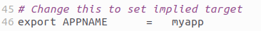

# The Template Project

## Install prerequisites

On Debian Linux, use the `apt` to install the required packages.

`sudo apt install sdcc make sed cpmtools` 

## Create a new repository

Please create a new repository on *GitHub* and clone it to your local drive.

`clone <my repository address> <my repository directory>`

Alternatively, you can create a local repository.

`mkdir <my repository directory>`

`cd <my repository directory>`

`git init`

## Unzip the template project into it

Download and unzip the template project into your project folder. 

`unzip template.zip <my repository directory>`

The directory structure below will be the result.

## Add this library as a submodule

Go to the `lib/` directory in your repository directory

`cd <my repository directory>`

`cd lib`

And add this library as a submodule

`git submodule add https://github.com/tstih/idp-udev.git`

## Make

Return to your repository directory and execute `make`.

`cd <my repository directory>`

`make APPNAME=<my application name>`

The make will create subdirectories `build/` with your program and `bin/` with all relevant binaries.

 > If you don't want to pass the `APPNAME` argument, you can change the default `APPNAME` inside the Makefile on the root folder. 
 > 
 > 

## Run in the emulator

The build process creates an Iskra Delta Partner disk image using the `cpm tools`. After the compilation, you can find it in the `bin/` directory. In [the emulator](http://matejhorvat.si/sl/slorac/delta/partner/index.htm), mount this drive by pressing `Alt+O` and selecting file `fddb.img` (the CP/M disk image) from the `bin/` directory. Change the drive letter to `B:` by typing command `B:` into the emulator. And run your program by typing in its name.

## Add your source files

Any `.c` file you add under the `src/` folder will be compiled into the binary. Any `.s` file will be compiled using the SDCC assembler. You can use subdirectories. 

> If you'd like to add data files to your disk image, add them to the `disk/extras/` directory. Anything in this directory will be copied to the final CP/M disk image to user area 0:. The files placed here must respect the CP/M filename limits: they can only have 8 letters for the name and 3 letters for the extension.

